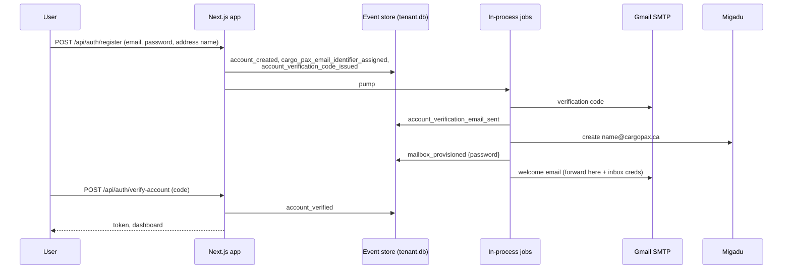
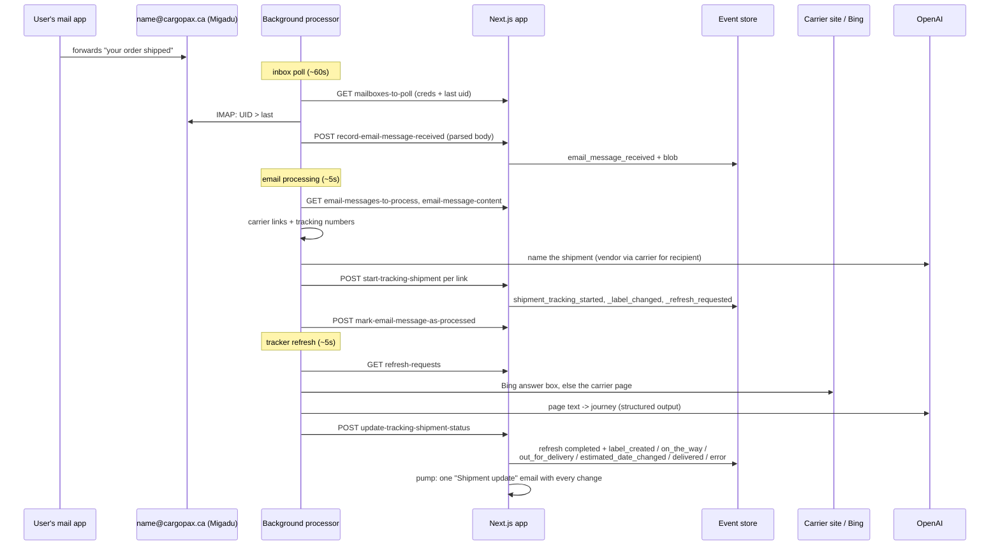

# CargoPax

Forward your shipment emails to your own `<name>@cargopax.ca` address and
CargoPax follows every package for you. It picks the carrier tracking links
(UPS, FedEx, USPS, DHL, Canada Post, Purolator) out of each forwarded email,
renders the tracking page in a headless browser, has a language model read
the journey off it (label created, on the way, out for delivery, delivered,
estimated date), and emails you as the package moves. You can paste a
tracking link by hand too — or just the tracking number: the carrier is
identified from the number's format, and a dropdown (which fills itself in)
settles the cases where formats overlap.

This is the [8exgh/cargopax](https://github.com/8exgh/cargopax) product
rebuilt on the `starter-sites` / `inventory-shopify` stack: Next.js,
TypeScript, SQLite, CQRS + Event Sourcing (Adam Dymitruk / Martin Dilger),
and **no AWS**. What the original did with AWS is done here as:

| Original (AWS) | Here |
|---|---|
| Cognito signup / verify code / signin / reset | Own auth: bcrypt + JWT, 6-digit verification code by email, link-based reset |
| Inbound email: SES → S3 → Lambda → Postgres | Each account gets a real Migadu mailbox; the processor polls it over IMAP |
| Raw emails in S3 | Parsed body stored as the `email_message_received` event's blob (SQLite) |
| SES outbound + SES identity verification | Gmail SMTP (nodemailer); notifications go to the verified account email |
| Apple / Android push (APNs + FCM, native app) | **Web push** instead: browsers, installed PWAs, and iPhone/iPad once added to the Home Screen - one VAPID keypair, no Apple certificates or Firebase project |
| TypeChat + GPT-3.5, five questions per page | OpenAI structured outputs, one call per page (`gpt-5.4-mini`) |
| Postgres event store | SQLite, one event store per account |

## The public site

`nextjs-app/app/(marketing)/` is the part a search engine sees: home,
`/how-it-works`, `/carriers`, `/about`, `/privacy`, and `/blog` with its
posts (`lib/blog.tsx`). It is a separate root layout from the signed-in app,
server-rendered with no client JavaScript, and every page is prerendered at
build time.

Signing in moved to `/login` so `/` could be a page with something on it -
before this the most-linked URL on the site was a 45-word login form.

What is deliberate here, rather than habit:

- **One canonical host.** The app answers on more than one hostname, so
  every page carries a canonical URL. That host is resolved at *build* time
  (`getSiteUrl`, `NEXT_PUBLIC_SITE_URL`, defaulting to the live domain), not
  at runtime: these pages are prerendered, so a runtime variable is read too
  late and the canonical would have shipped as `http://localhost:3000`.
- **`robots.ts` and `sitemap.ts`** list the public pages only. The signed-in
  app is disallowed: it would yield a login screen and nothing rankable.
- **Structured data describes what is on the page** (Organization, WebSite,
  BlogPosting, BreadcrumbList) and nothing that is not.
- **No doorway pages.** Each page answers a different question; there is no
  per-carrier or per-city page repeating the same copy.

## Organizations and people

Signing up creates an **organization** and makes you its admin. It has a
name, an optional logo, one `@cargopax.ca` forwarding address, and one
shared set of shipments.

An admin adds people by email; they get a one-time password and are asked to
change it on first sign-in. **New people are read-only** — they see every
shipment and can **ask for a fresh check on any of them**, which is the part
everyone actually wants, but cannot change what is tracked, who is in the
organization, or what it is called. An admin can promote anyone to admin, or
demote them; the last admin cannot be demoted or removed, so an organization
can never be left with nobody who can manage it.

| | read only | admin |
|---|---|---|
| See shipments, journeys, forwarded emails | ✅ | ✅ |
| Refresh a shipment's status | ✅ | ✅ |
| Notifications on their own device | ✅ | ✅ |
| Add, rename, group or delete shipments | — | ✅ |
| Add people, change roles, remove people | — | ✅ |
| Rename the organization, set the logo, change the address | — | ✅ |

The role lives in the users table beside the credentials, and every request
reads it there rather than from the token — so a demotion or removal takes
effect on the next request, not whenever a week-old JWT happens to expire.
The organization's own facts (name, logo, who was invited and by whom) are
events on its stream; the logo is stored as the event's blob, so there is no
upload directory or object store.

## Architecture

### Components

1. **Next.js app** (`nextjs-app/`) — UI, command and query API routes, the
   event stores, and the in-process jobs (inbox provisioning, every
   outbound email)
2. **Background processor** (`background-processor/`) — the original's
   "scraper": inbox poll (IMAP), email processing (links → trackers), and
   tracker refresh (Puppeteer + OpenAI); polls the app over HTTP with an
   API key
3. **SQLite** — `system.db` (accounts, users) + one event store per account
   (`tenants/<id>.db`)

### Flows





### The account aggregate

One aggregate per tenant, `aggregate_id = tenantId`. Events (names from the
original backend where the concept exists there):

| Area | Events |
|---|---|
| Organization | `organization_named`, `organization_logo_set` (+ blob), `organization_logo_removed`, `member_invited`, `member_role_changed`, `member_removed`, `invitation_email_sent` |
| Account / auth | `account_created`, `account_verification_code_issued`, `account_verification_email_sent`, `account_verified`, `password_reset_requested` / `_email_sent` / `_completed`, `owner_notified` |
| Address + mailbox | `cargo_pax_email_identifier_assigned`, `mailbox_provisioned`, `mailbox_provision_failed`, `mailbox_deleted`, `welcome_email_sent` |
| Forwarded emails | `email_message_received` (+ blob), `email_message_processed` |
| Groups | `group_created`, `shipment_tracker_assigned_to_group` |
| Trackers | `shipment_tracking_started`, `shipment_tracking_label_changed`, `shipment_tracking_refresh_requested`, `shipment_tracker_refresh_request_completed`, `shipment_label_created`, `shipment_on_the_way`, `shipment_out_for_delivery`, `shipment_estimated_delivery_date_changed`, `shipment_delivered`, `shipment_tracker_error_parsing_website_occurred`, `shipment_tracker_error_cleared`, `shipment_tracker_deleted` |
| Notifications | `email_notification_sent` (clears the tracker's pending changes) |

`lib/commands/event-replay.ts` folds the stream; `lib/commands/account-commands.ts`
holds the command handlers (load, replay, validate, append);
`lib/queries/account-queries.ts` holds the dashboard view, the processor's
three to-do queries, and the jobs' to-do queries. A status update only
appends events for values that actually changed, so re-scraping the same
page is a no-op apart from completing the refresh.

### In-process jobs (the 8examples "pump")

`lib/jobs.ts`: each job is a query for work without a completion marker,
then the side effect, then the marker event. `pumpJobs()` runs after
register, resend, forgot-password, an address change, a status update from
the processor, and on every processor poll of `/api/queries/refresh-requests`.
Jobs: verification email, inbox provisioning and retired-inbox deletion
(Migadu), welcome email, owner notification (sbennett@8examples.com),
shipment-update emails (one per tracker with every change since the last,
held until the tracker's scrape completes), password reset email.

### Notifications

Two channels, tracked separately so a failure in one never silences the
other: an **email** per tracker with everything that changed, and a **web
push** carrying the same batch (`lib/push.ts`, `public/sw.js`). Each tracker
keeps its own pending list per channel, cleared by `email_notification_sent`
and `push_notification_sent` respectively.

Devices subscribe from Settings; subscriptions live in the account stream as
`web_push_subscription_registered` / `_removed`, which is the shape the
original used for `apple_device_registered` / `_unregistered`. A subscription
the push service reports as gone (404/410) is dropped automatically. When a
push arrives the service worker also nudges any open tab to refresh, so the
dashboard is current behind the notification.

**iPhone and iPad:** Apple only delivers web push to a site added to the Home
Screen - never from a Safari tab - so the Settings page detects iOS-in-a-tab
and shows the Add to Home Screen steps instead of a button that cannot work.
The manifest (`app/manifest.ts`) and icons exist to make that install look
right. `POST /api/commands/send-test-push` sends a test notification, which
is the only way to be certain an iOS install took.

### Email

Two services, lifted from `8examples`:

- **Sending**: Gmail SMTP via nodemailer (`GMAIL_USER` / `GMAIL_APP_PASSWORD`).
  Owner notifications go to `NOTIFY_EMAIL` (default `sbennett@8examples.com`).
- **Inboxes**: Migadu admin API (`MIGADU_ADMIN_EMAIL` / `MIGADU_API_KEY`).
  Mailboxes are created per account by the job and read by the processor
  over IMAP with the same credentials. Changing the address in Settings
  provisions a new mailbox and deletes the old one.
- **The mail domain itself**: `lib/mail-domain.ts` converges it on every
  pump (ported from 8examples' `ensureMailboxDns`) — adds `MAIL_DOMAIN` to
  the Migadu account, reads the DNS records Migadu wants, publishes them
  when the zone is on Cloudflare (`CLOUDFLARE_API_TOKEN`), and asks Migadu
  to activate. When the zone lives elsewhere it reports the exact records
  instead: `GET /api/queries/mail-domain` (API key; `?recheck=1` forces a
  live run), and mailbox provisioning fails with the domain's real reason
  rather than a per-mailbox API error.

  **`cargopax.ca` is not ready for this yet** (checked 2026-08-23): its
  nameservers are Google Cloud DNS and its `MX` still points at
  `inbound-smtp.us-east-1.amazonaws.com`, i.e. the original app's SES
  pipeline. Pointing mail at Migadu is a live cutover of the old product's
  inbound mail, so it is deliberately left as an owner decision — see
  "Before production" below.

`EMAIL_TEST_MODE=1` logs emails and fakes mailbox creation for local dev.

### Tracker refresh (OpenAI + Puppeteer)

The processor tries Bing's package-tracking answer box first for
UPS/FedEx/USPS/DHL (the original's trick; `TRACKING_USE_BING=false`
disables it) and falls back to the carrier page. The rendered page is
stripped to text (scripts, styles, nav boilerplate out; 40k-char cap) and
`gpt-5.4-mini` returns the whole journey as strict JSON via the Responses
API (`ShipmentJourneySchema`; ISO dates; today's date in the prompt). The
same model names each emailed shipment ("Lee Valley via UPS for Jane").
Model is `OPENAI_MODEL`; `gpt-5-mini` or `gpt-5.6-luna` are cheaper.

A number typed straight into the dashboard is matched against those same
formats (`lib/tracking/tracking-input.ts`): one match builds the carrier's
tracking url, several (12 digits is FedEx or Purolator) ask the user to pick,
and a pasted link always wins over the dropdown because its host is
authoritative.

Only known carrier hosts are ever loaded in the browser (the SSRF guard;
`TRACKING_ALLOWED_HOSTS` overrides for local fixtures). A link in a
forwarded email is tracked only when its host is a carrier **and** it
carries a token in that carrier's own tracking-number format (`carrier.ts`:
UPS `1Z`+16, FedEx 12/15/20/22 digits, USPS 20-26 digits or `XX999999999XX`,
DHL 10-11 digits or `JD…`, Canada Post 16 digits, Purolator 12 digits), so
campaign ids and session tokens in the same emails are left alone.

## Before production

Run `gh workflow run diag-cargo-pax.yml -R 8exgh/devops` at any time for the
live mail-domain state (including the DNS records still to publish) and
recent container logs; there is no SSH to server7.

1. **Decide the mail domain.** `MAIL_DOMAIN` is configurable. Either cut
   `cargopax.ca` over to Migadu (replace the SES `MX`, add SPF/DKIM/DMARC —
   this stops the original AWS app receiving mail), or point the rebuild at
   a domain that is already on the Migadu account (e.g. a subdomain such as
   `in.cargopax.ca`, which can run alongside the old pipeline).
2. **Optionally move that zone to Cloudflare** and set `CLOUDFLARE_API_TOKEN`
   so the app publishes and repairs the mail records itself. Otherwise read
   them off `GET /api/queries/mail-domain` and publish them by hand once.
3. **`DEPLOY_TOKEN`** on this repo: done — a PAT with `repo` scope on
   `8exgh/devops`, so CI can dispatch the deploy.
4. **Public route**: done — the site answers on
   <https://cargopax.fusenv.com> through the Server3 tunnel
   (`configure-cargo-pax-cloudflare.yml` in devops). It is on `fusenv.com`
   because a `cfargotunnel.com` CNAME only resolves when Cloudflare proxies
   it, which `cargopax.ca` cannot do from Google Cloud DNS; change
   `HOSTNAME`/`ZONE_NAME` in that workflow and re-run once the zone moves.

## Getting Started

### Prerequisites

- Node.js 22+
- npm

### 1. Generate secrets

```bash
openssl rand -base64 32   # JWT_SECRET
openssl rand -base64 32   # BACKGROUND_PROCESSOR_API_KEY
```

### 2. Install & configure

```bash
cd nextjs-app
npm install
cp .env.example .env    # JWT_SECRET, BACKGROUND_PROCESSOR_API_KEY; leave EMAIL_TEST_MODE=1

cd ../background-processor
npm install             # downloads a Chrome for Puppeteer
cp .env.example .env    # NEXTJS_API_KEY must match; OPENAI_API_KEY
```

### 3. Run

```bash
# Terminal 1
cd nextjs-app && npm run dev

# Terminal 2
cd background-processor && npm run dev
```

Open http://localhost:3000, register (pick your address), take the
verification code from the app's log, paste a tracking url, and watch the
processor fill in the journey. With `EMAIL_TEST_MODE=1` every email is
printed to the app's log and no real inbox exists, so the IMAP poll has
nothing to read; to exercise the inbound path locally run a test IMAP
server (e.g. `greenmail/standalone` with `-Dgreenmail.auth.disabled`,
`IMAP_HOST=127.0.0.1 IMAP_PORT=3993 IMAP_TLS_REJECT_UNAUTHORIZED=false`)
and send a message to the account's address over its SMTP port.

Dev reset: delete `nextjs-app/data/` and clear browser localStorage.

### Tests

```bash
cd background-processor
npm test     # carrier mapping, tracking-number heuristic, email link extraction,
             # html stripping, journey -> command mapping, analyzer (model mocked)
```

## API

### Authentication

- `POST /api/auth/register` — `{ email, password, emailIdentifier }`; returns a token and `needsVerification`
- `POST /api/auth/verify-account` — `{ email, code }`
- `POST /api/auth/resend-verification` — `{ email }`
- `POST /api/auth/login` — `needsVerification: true` until verified
- `POST /api/auth/change-password`, `POST /api/auth/forgot-password`, `POST /api/auth/reset-password`, `GET /api/auth/me`

### Commands (admin of a verified organization)

- `POST /api/commands/start-tracking-shipment` — `{ input, company? }` where `input` is a carrier link **or** a bare tracking number; 400 `reason: "ambiguous"` with `candidates` when the number fits more than one carrier
- `POST /api/commands/update-tracking-shipment-label` — `{ trackerId, label }`
- `POST /api/commands/delete-tracking-shipment` — `{ trackerId }`
- `POST /api/commands/refresh-trackers` — **any member**, not just admins
- `POST /api/commands/create-group` — `{ name }`
- `POST /api/commands/assign-tracker-to-group` — `{ trackerId, groupId | null }`
- `POST /api/commands/assign-cargo-pax-email-identifier` — `{ emailIdentifier }`
- `POST /api/commands/register-push-subscription` / `remove-push-subscription` — this device's web push subscription
- `POST /api/commands/send-test-push` — prove notifications reach the device
- `POST /api/commands/invite-member` / `change-member-role` / `remove-member` (admin)
- `POST /api/commands/name-organization` / `set-organization-logo` (multipart) / `remove-organization-logo` (admin)
- `POST /api/commands/submit-feedback` (public, rate limited)

### Commands (background processor, API key)

- `POST /api/commands/record-email-message-received`
- `POST /api/commands/start-tracking-shipment` — with `tenantId`, carrier, tracking number, label, `messageId`
- `POST /api/commands/mark-email-message-as-processed`
- `POST /api/commands/update-tracking-shipment-status`

### Queries

- `GET /api/queries/account` — the dashboard view, including the organization, your role and the people in it (403 + `needsVerification` until verified)
- `GET /api/queries/organization-logo` — the logo, to the organization's own people only
- `GET /api/queries/mailbox-availability?localPart=` (public)
- `GET /api/queries/push-config` (public) — the VAPID public key browsers subscribe with
- `GET /api/queries/mailboxes-to-poll`, `email-messages-to-process`, `email-message-content`, `refresh-requests` (API key)
- `GET /api/queries/mail-domain` — mail-domain convergence state and any DNS records still to publish (API key)
- `GET /api/queries/feedback`

### Operational

- `GET /api/health`

Sample requests live in `http/`.

## Databases

`data/system.db`: tenants (with the UNIQUE address name), users, feedback.
Created on first boot; evolved by `nextjs-app/scripts/migrate-system-db.js`
at container start.

`data/tenants/<tenant-uuid>.db`: the account's event store:

```sql
CREATE TABLE events (
    id INTEGER PRIMARY KEY AUTOINCREMENT,
    aggregate_id TEXT NOT NULL,
    event_type TEXT NOT NULL,
    event_data TEXT NOT NULL,  -- JSON
    payload_blob BLOB,          -- parsed email body on email_message_received
    timestamp INTEGER NOT NULL,
    version INTEGER NOT NULL
);
```

## CI/CD

`.github/workflows/build-and-deploy.yml` builds both images, pushes them to
ghcr.io, and sends `repository_dispatch` type `cargo-pax-deploy` to the
`devops` repo. Images: `ghcr.io/8exgh/cargo-pax-backend` and
`ghcr.io/8exgh/cargo-pax-processor`. Needs the `DEPLOY_TOKEN` secret on this
repo (PAT with repo scope on `8exgh/devops`).

The devops side is `deploy-cargo-pax.yml` (server7, port 3056, data in
`/opt/cargo-pax/data`) and injects:

| Container | Env | devops secret |
|---|---|---|
| backend | `JWT_SECRET` | `CARGO_PAX_JWT_SECRET` |
| backend + processor | `BACKGROUND_PROCESSOR_API_KEY` / `NEXTJS_API_KEY` | `CARGO_PAX_BACKGROUND_PROCESSOR_API_KEY` |
| backend | `GMAIL_USER`, `GMAIL_APP_PASSWORD` | `GMAIL_8EXAMPLES_USER`, `GMAIL_8EXAMPLES_APP_PASSWORD` |
| backend | `MIGADU_ADMIN_EMAIL`, `MIGADU_API_KEY` | `MIGADU_8EXAMPLES_ADMIN_EMAIL`, `MIGADU_8EXAMPLES_API_KEY` |
| processor | `OPENAI_API_KEY` | `OPENAI_API_KEY` |

The processor reads each inbox with the credentials the app issued, so it
needs no mail secrets of its own.

## Tech Stack

- **Frontend:** Next.js 16, React 19, TypeScript, Tailwind CSS
- **Backend:** Next.js API Routes, better-sqlite3, nodemailer, Migadu API
- **Processor:** Puppeteer (Chromium), imapflow + mailparser, OpenAI Responses API (structured outputs), Jest
- **Authentication:** JWT, bcrypt; email verification codes; email password resets
- **Deployment:** Docker (multi-stage, Node 22), GitHub Actions → ghcr.io → self-hosted runner
